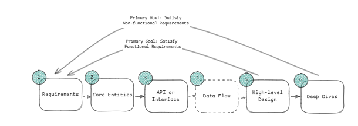

## Rate Limiter 
### A rate limit controlls how many request a client can make withing a specific timeframe. It acts as a traffic controller for your APIs. For ex. 100 requests per minute from a user, then rejecting excess requests with an HTTP 429 "Too Many Requests" response. Rate limiters prevent abuse, protect your servers from being overwhelmed by bursts of traffic, and ensure fair usage across all users.



#### Functional Requirement

1. Identify user based on userId, ip or api key
2. limit request based on configurable rule
3. when limits are exceeded, system should reject request with proper Status code and appropriate headers.

> [!TIP]
 >  At this point you should ask your interviewer for scale expectation, whether we are building for startup or massive scale platform like social media.
 >Here, we'll design for substantial but realistic load : 100M user per day making 1 M request per second


#### Non Functional Requirement

1. Latency overhead should not be >10ms i.e a request should either be accepted or rejected between this timeframe
2. Syste should be high available , eventual consistency is ok , as slight delay in sharing the limit across nodes is acceptable
3. The system should handle 1M RPS across 100M DAU

-----------

#### Core Entities

1. Rules: The rate limiting policies that define limits for different scenarios. Each rule specifies parameters like requests per time window, which clients it applies to, and what endpoints it covers. For example: "authenticated users get 1000 requests/hour" or "the search API allows 10 requests/minute per IP."
2. Clients: The entities being rate limited - this could be users (identified by user ID), IP addresses, API keys, or combinations thereof. Each client has associated rate limiting state that tracks their current usage against applicable rules.
3. Requests: The incoming API requests that need to be evaluated against rate limiting rules. Each request carries context like client identity, endpoint being accessed, and timestamp that determines which rules apply and how to track usage.

---

#### API or Interfaces

This interface is called by services to know whether the request is allowed or not with given ip/clientId and corresponding rule

```java
isRequestAllowed(clientId, ruleId) -> {passed : true, remaining : number, resetTime : timestamp}
```
---

#### High Level Design

> [!TIP]Here we start with MVP design which satisfies the requirement . This does not need to scale or anything we will build on top of it. We will walk through each functional requirement to make sure it satisfies the requirement.

The system should identify clients by user ID, IP address, or API key to apply appropriate limit

Solution: We need answer this question to fully satisfy this requirement a) Where should our rate limiter reside ? 

   ##### In Process/Microservice : If every service have their own rate limiter locally 

   Each application server or microservice has rate limiting built directly into the application code. When a request comes in, the server checks its local in-memory counters, updates them, and decides whether to allow or reject the request. This is really fast since everything happens in memory, no network calls, no external dependencies.

##### Challenges 
There won't be global level control or policies

Reference Link : [text](https://www.hellointerview.com/learn/system-design/problem-breakdowns/distributed-rate-limiter)